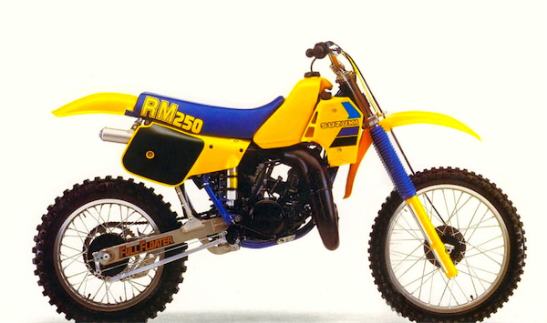

## Here is something pretty awesome...  I found this article on the web but I did purchase and read this issue in 1984.

### I read every word several times over.  Honda was the big deal for me back in those days- they could do no wrong.  The Suzuki was picked as the winner for this shootout.  I remember how brand bias I was.  There was always so much talk about how great the Suzuki suspension and handling was but I stood firm behind my own brand.  I would scoff at the notion that a Suzuki could be better than my Honda at anything.  For me, as I grew older I abandoned that brand loyalty and opened my mind to anything that would throw roost.  Remembering how the Full Floater was all the rage is what made me want to buy an RM250 as my first restoration project.
  
## [Download the Shootout in PDF](dbikesep84250mxsoot.pdf)

When I was a kid, my Brother Bernie bought every issue of [Dirt Bike](http://dirtbikemagazine.com/) Magazine.  I remember going through every one on them.  When I was in high school, I would buy my own copies. Dirt Bike was my favourite of the MX magazines.  They covered more than Motocross, but Moto was their core.  I loved the editorials by Super Hunky - Rick Sieman.  They were priceless stories and I remember laughing out loud at most of them.  We gave my brother Pat the nickname Super Hunky II because like Rick Sieman, he was carrying a little extra weight.  I always enjoyed the shootouts and bike tests.  The problem with the shootouts is they were always published long after people made purchase decisions.

{.img-responsive}
## A nice photo of the 84 RM. 