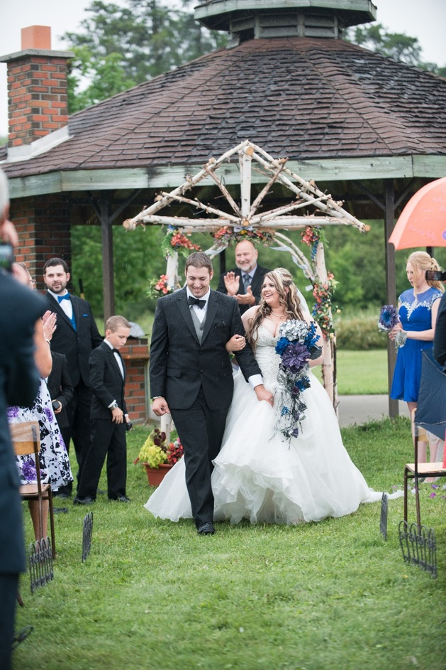
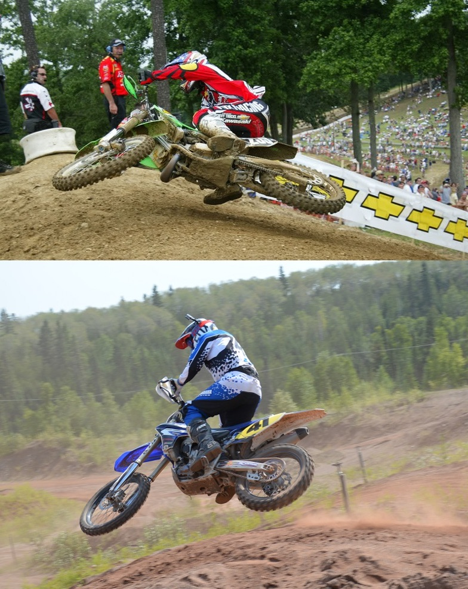

So why would I try to make an 84 RM fly? My Uncle Mike was right on the money, I watched my Dad do it and refused to be outdone, especially during the week of my wedding.

> This story is part counter-story to [So how far can you safely jump a 1984 Suzuki?](http://localhost/vintagemoto.ca/notes/jumping-big-at-charleston)

Contrary to popular belief, riding Motocross in Atikokan was not the sole reason for having the wedding there. My now wife Arren’s parents were both grew up in the nearby city of Thunder Bay. And so, her extended family, including grandparents whom have difficulties travelling far, reside in Thunder Bay, making Atikokan a central location for family spread out across the country. 

{.img-responsive}
### My very understanding wife and I on our wedding day.

In hindsight, I may have spent too many days at the track, which may or may not have caused the last two days before the wedding to be extremely hectic… And stressful. I have a very understanding wife.

For months prior to the wedding I would comment on my Uncle Mike’s posts about his beautifully restored RM, and how I was going to crash it. I would say things like, “Wow you guys did a really good job restoring that bike, it looks great! I can’t wait to ugly it up at my wedding”. In reality, I had no plans of the sort. In fact, prior to watching my Dad hit every jump like that, I had already decided to take it easy.

The last Suzuki I rode, a 2006 RM 250, was not exactly a smooth jumping machine. I always seemed to land sideways, or with my front end pointed to the moon, so I had assumed the ‘84 RM would give me the same grief. After watching my Dad stretch out the 110 footer, I knew I was going to have to swallow my fear of jumping the old yellow beast, or suffer ridicule from him.

{.img-responsive}
### A Honda rider, whose name I forgot, that showed up on our second day at the track. He was an excellent rider, and I enjoyed riding with him.

There was no doubt in my mind that I could do a “better lap” than my Dad, as I was riding faster than I had ever ridden in my life over the last few days. Our second day at the track, I remember my Dad and I watching a Honda rider spinning out fast laps on the track. As we were getting geared up we both watched in awe talking about how he is going to make us look bad. The wife of course looks at me, chin held high, “Nope, you’re faster”. My Dad and I both disagreed, he just looked so fast. So my Dad decided he would pull out a little bit ahead of the Honda rider when he went out for his next set of laps to “make him work hard to get around me”, as he put it. So he pulled ahead of the guy on the Honda, and I followed behind the Honda rider. The Honda guy was fast, but it turns out my wife was right, I was faster. Halfway through the first lap I passed the guy on the honda, and 4 corners later I passed my Dad.

Back to the story at hand, my confidence was up, Uncle Mike had proven the old bike could go fast, and now my Dad had proven it could also fly. As I slung my leg over the Suzuki, I still wasn’t planning on riding very aggressively. At first it felt alien to me, the footpegs were incredibly narrow, and the seat had a deep dip in the middle which felt awkward. 

{.img-responsive}
### This picture really showcases how narrow the foot pegs are.

I pulled up to the start line, with some trepidation, and decided to just hold it wide open down the start hill… Just to see how it would feel. All feelings of awkwardness vanished as soon as I cracked the throttle. The engine was a lot more snappy than I had anticipated, having incredible power in the midrange. As I roared down the hill and came to the uphill, first corner, I didn’t back down. The bike no longer felt alien to me, I had become completely at home. I hit the first jump, the bike didn’t do anything unexpected. I will admit, I was a little hard on the clutch as many years of four stroke riding has made me forget how to ride a two stroke a bit. I kept a finger on the clutch most of the time, and would feather it now and then to get me back into the power. When it came to the 110 foot jump I didn’t hesitate. I hit the outside line and approached the ramp with a lot of speed. As I usually do, I backed off a little going over the ramp to just make it to the landing ramp. (I had come pretty close to overjumping the jump a few times, and watched My Dad almost do it as well)

### Some onboard footage of jumping 110’ on the Suzuki, I put the jumping portion in slow motion so you can really appreciate the distance covered.

I didn’t have a flawless lap, but it was not the bike at fault. I briefly hit neutral in one corner, and near the end of the lap became a little over zealous and tried a “Bubba Scrub”. I didn’t scrub hard enough making me overjump the hip jump, which in turn forced me to hit the downhill mini triple as a double and roll the last hump. As I crossed over the finish line I decided I was becoming too comfortable on the Suzuki. I didn’t *actually* want to be the guy to crash this restored machine, so I returned it to Uncle Mike to avoid that scenario.

{.img-responsive}
### I sure thought I was throwing out “Bubba Scrubs”, but as is evident in this picture, I’m no Bubba.

So, how does one make an 84 RM fly? The same way you would any bike. A lot has changed on motocross bikes over the last few decades, but at the end of the day they are all just as capable of flight as a new bike.

I had a great time riding with my family and friends this summer, and look forward to the next time we can all meet up again. It never ceases to amaze me how fast my Dad, and Uncles (who are all over 50) can ride. 
