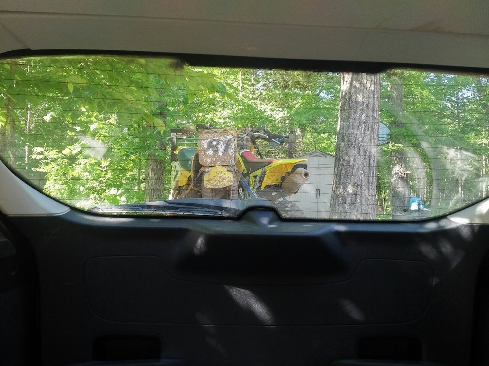
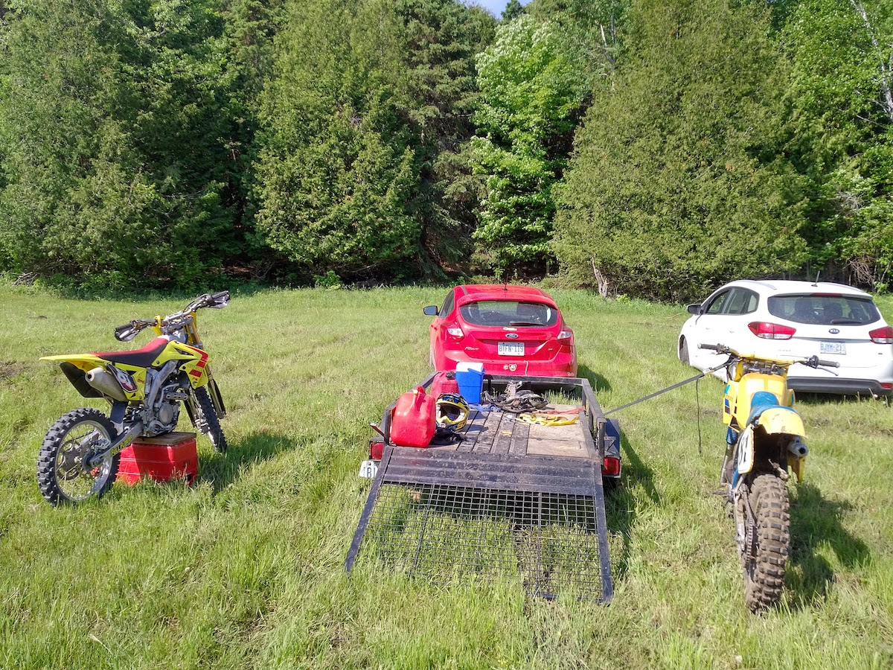
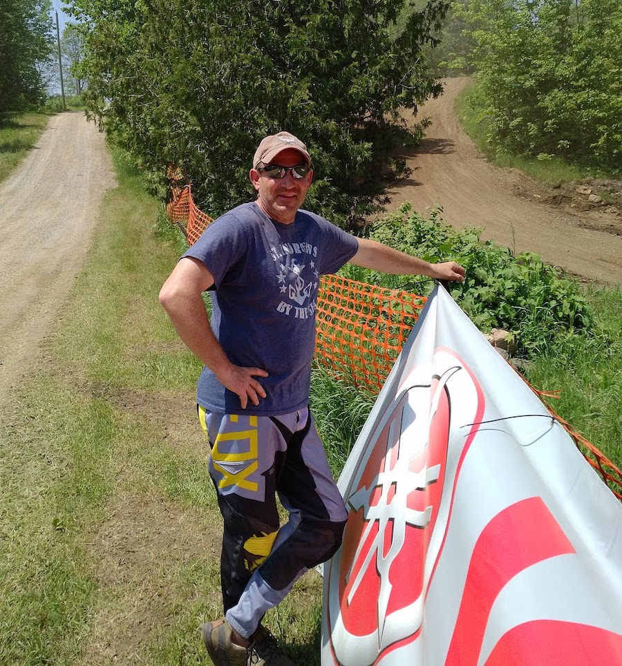
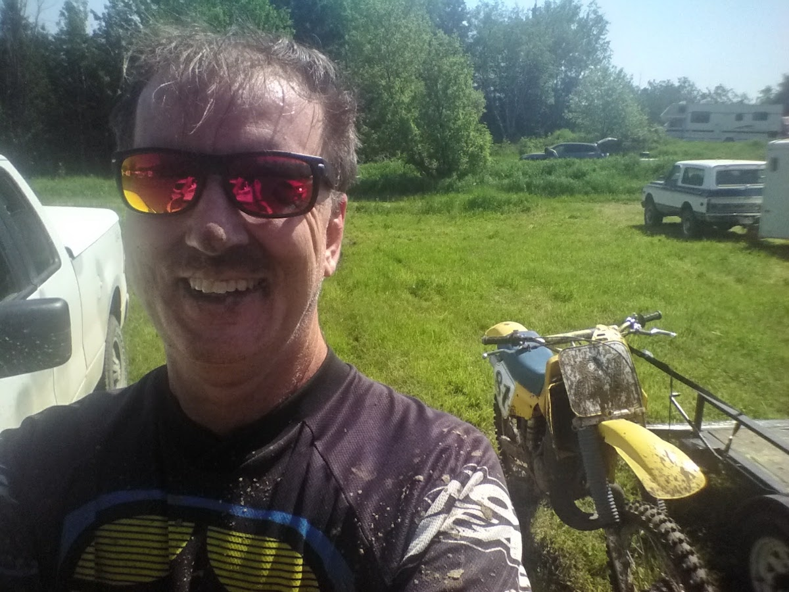
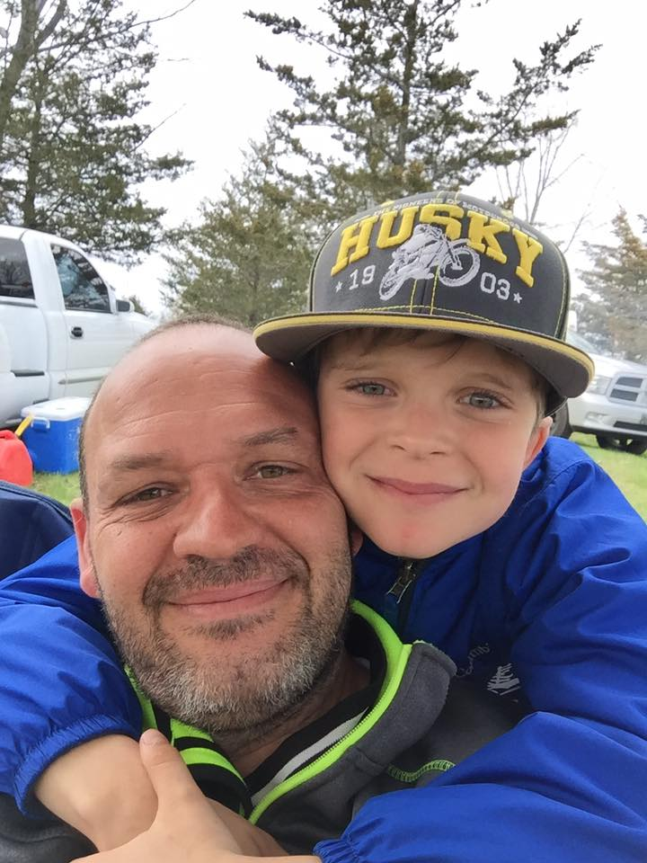
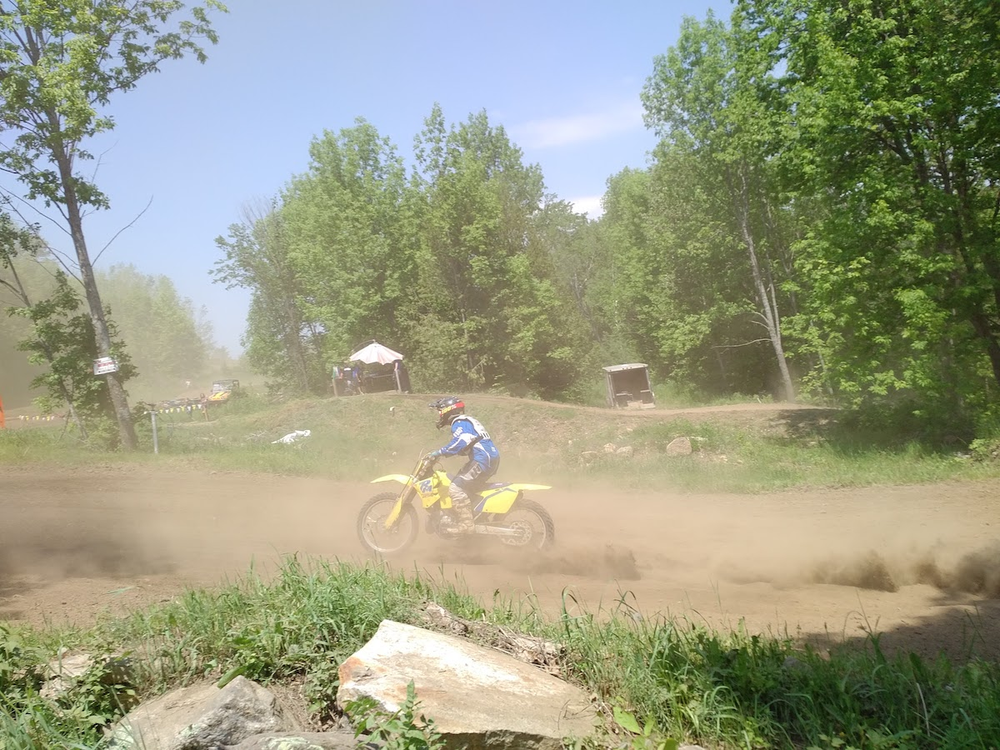
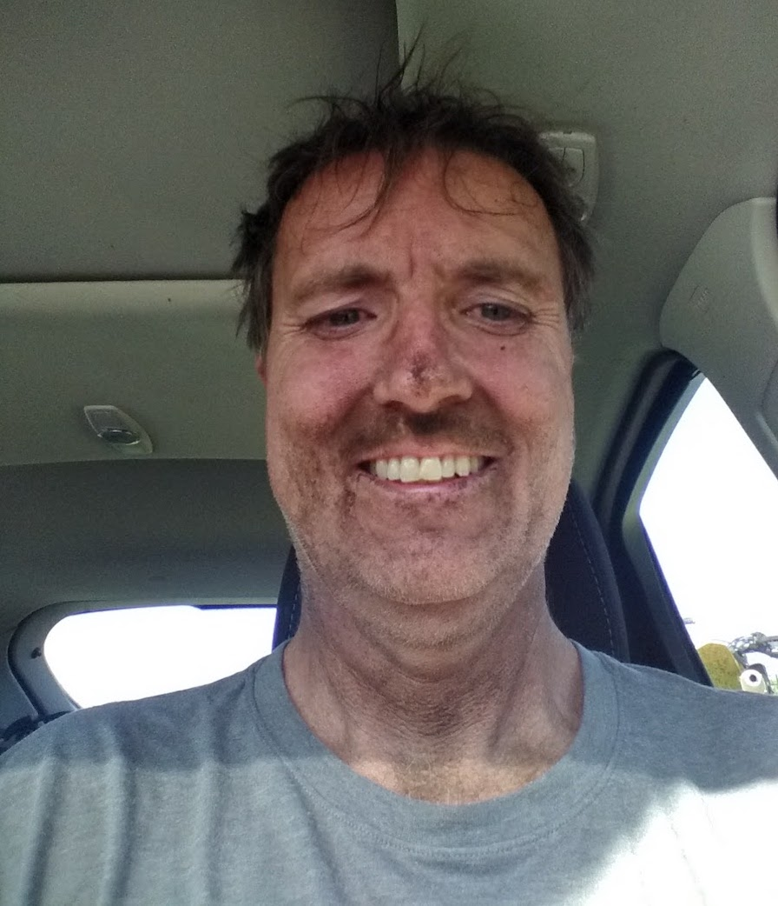

Just like I would have done back in '84, I woke early, jumped in the car and set out to the races.  And just like back in the day, I had two bikes in tow.  Many motocross racers in the 80s had two bikes; a 125 and a 250. If you wanted to run more than two motos in a day, your only option was to buy two bikes.  I never had the scratch to own two bikes, but I always had at least one brother to share racing adventures with and we would load up our bikes and drive off together.

{.img-responsive}
### In 1983 CMA assigned me 81 and Pat 82.  We would go off to the races in whatever vehicle we had at our disposal.  This is the view through the rear window of a 1967 Volvo four-door sedan.  See the fenders on the trailer?

{.img-responsive}
### Here is the view through the rear window of a Ford Focus some 33 years later.  Same number, 81 is my sentimental favourite MX number.

It has been at least a dozen years since I sold my Yamaha motorcycle and bought a Yamaha guitar and while I have managed to log some seat-time on borrowed bikes over the years, I have not raced since. Now I have two bikes of my own.  One is the vintage RM-250 from 1984 and the other is a 2013 RMZ-250.  The plan is to race the old bike in the old-man's class and the new bike in the slightly younger old-man's class.

The sun was up, the sky was blue and there was a lovely wind blowing.  I wheeled into KMMX at 8:15AM, just in time for rider's meet.  The pits were packed with fellow racers, their gear and crew.  I got my car stuck in the soft grass as I pulled in so I pitted right where the tires of my car started to spin.  I signed up to race +35 and +45, attended the riders meet and then it was time to practice.  The day was moving along, no time to spare. 

{.img-responsive}
### This has been a long cool and wet Spring.  This field is wet and the two cars you see are stuck.

As I am putting on my gear, an old racing friend, Pete McPhail came over and said hi.  I saw Pete in Kamloops a couple years ago, he was spinning wrenches for Team MX-101 in the Canadian Nationals.  Pete also has an old RM-250, not vintage, it is still a great competitive bike.  Last time I raced with Pete, he was newly married and a recent father.  Now he has two kids racing motocross. Great to see old friends.

I decided I was going to practice on the '84.  I knew I could ride the new bike just fine, this old beast takes some getting used to.  I fired it up and headed track-side.  Showing up ready-to-race mounted on a 33-year-old bike wins you instant favour.  People were certainly tickled to see this old gem.  Soon it was my turn to spin some laps and learn the track so I headed down to the gates and that is were I first met my rival-du-jour.

His name was Plasse-18- it said so on the back of his jersey.  He had a shiny Yamaha YZ-450F in the white colour scheme.  This was one of those modern 4-stroke bikes with the engine tilted backward.  Adorned with some shiny GYTR parts, this bike has power north of 60HP and is a favourite among likes of Cooper Web and Chad Reed.  I looked over at this Plasse-18 guy and thought of my veteran MX theory; *It does not matter what age-class you go into, the same guys that were fast in the old class will just follow you to the new class*.  Once practice started, I don't recall where Plasse-18 was on the track, I was just doing my laps and learning the track.  I did however notice another Yamaha 450 with the pro number 15 on his number-plates.  He caught up to me and passed me in pretty short order so I was thinking this old-man class was stacked with talent.  I made up an acronym for these guys... F.O.Gs.  Fast Old Guys. 

There was a little time between practice and first moto so I had some time so socialize.  I met a F.O.G. named Vince.  He was pitted near where my car was stuck and we engaged in some great bench racing.

{.img-responsive}
### This is Vince from Pembroke, he rides an RMZ-450 and like the rest of us, loves his motocross.

**First Moto +45:**  
Before too long, it was time to race.  Up first is the +45, up last is the +35 so I headed down to the gates.  Vince and I picked two gates on the far outside and we waited for the board to go up.  Plasse-18 picked a gate a few spots over to the inside.  The board went up, went sideways and few seconds later the gate dropped and the race was on.  Much to my surprise and to the delight of the crowd, I pulled a hole-shot with a 33-year-old bike.  There were not a lot of us on the line, but it was still a great hole-shot.  The start is sweeping right turn up a hill which you launch yourself off of once you reach the top.  I did a first gear start and stayed hard on the gas as I went through the gears.  I had the bike in a full-throttle slide around the sweeper and I hit the launch hard for maximum air-time.  We landed in front of the crowd and headed up the next hill which is where Plasse-18 had a power advantage. By the time we reached the top, he was inching by so I headed for the far inside at the off-camber uphill turn to try and stop the pass.  Plasse-18 headed for the same line and completed a full-contact block pass.  Full contact!  Does he not know we are now old men?  Does he not know how hard it is to find parts for a 1984 motocross bike?

To my surprise, I stayed pretty close to the rear wheel of that big Yamaha.  The pressure was on but I could not find a place to pass.  I could see people on the track cheering me on- riding an old bike really wins a guy some fans.  A lap later and I am still on his tail and the battle continued.  In a sharp hairpin turn Plasse-18 made a mistake and lucky for him, I broke his fall. He fell against my front wheel and we were both stopped. I had to wait for him to get going so I could go myself.  His mistake put me a few seconds behind, but I was able to catch up.  I tried to make a pass by taking the far inside line by the start gate turn but he got me back at the top of the hill.  I made another go at the off-camber and again, full-contact and I almost went down.  Having lost a few more seconds, I again reeled him in and went for the pass again near the start gate.  This time I was able to make it stick. One lap to go and all I needed to do was keep that 450 at bay and thankfully, we are both old guys so we are both tired.  90-seconds later we take the checkers and my 33-year-old bike wins the first moto it has ever been in.  Plasse-18 and I returned to the pits, one moto down but I need one more for the overall.

{.img-responsive}
### Being a team of one, I am also my own photographer. In the background you can see how Pete McPhail rolls.  That is a 1971 Chevy Blazer.

There was a long break until my next turn on the track and I was really looking forward to moto-1 of the +35 class.  I got to race my new bike.  The old bike is cool, but a modern 250 four-stroke is a lot easier to ride and after the great battle with Plasse-18, I was pumped and ready for more.  I cruised the pits with Vince and watched some of the action.  Everybody was having a great time and I had several people commend me on that first-moto battle.  I also got to talk to Plasse-18 who obviously enjoyed the battle too. He asked me why he hadn't seen me at the races before.  "First time I raced in 12-years." I said.  "Way to make a guy feel good!" he said. "I have ridden a lot!" I said offering up some modesty.  

Motocross is an amazing sport.  When I am doing laps, I am working hard, feeling good, feeling fast.  I feel like I am riding like I did in my younger years, but then I get passed by someone and a few turns later they are gone. And then that someone who passed me, may get passed by someone else.  At one time, I was somewhat competitive with almost anyone at the local track.  Now, I am competitive with F.O.Gs. and it is every bit as satisfying as being competitive with the pros.

**First Moto +35**  
I proceeded to the staging on my four-stroke RMZ-250 for first moto of +35 and I meet the man mounted on that 450 YZ number-15 that made short work of me in practice.  He told me he used to race with me a few years back and low and behold it was Matt Seever.  We did turn circles together before I quit riding a dozen years ago.  He was a bit faster than me back in those days too.  We would race the Pro-Am class which was riders older than 25 on any displacement bike.  I would also ride Vet Master in those days but I think Matt was not thirty yet.  Matt raced pro for a few years and his best finish was a 14th at the Montreal Supercross.  He now lives in Pembroke and has a MX track in his yard.  My new friend Vince was pitted with Matt and they ride together in Pembroke.

I picked an outside gate again.  The board went up, turned sideways and the gate dropped.  I did the same thing on this bike as I did before and Matt and I launched beside each other and I followed him up the big hill.  A half a lap later, I was already a good piece behind him and a good piece ahead of third so I did my five laps alone. No battles to be had this time.  The only close call I had was when I pulled in the front brakes on the new bike- I almost went over the bars.  I guess my fingers were used to the extra firm squeeze that the '84 brakes required.  That was my first time racing a four-stroke.  I have ridden them a lot, but never raced one and I really enjoyed the experience.

**Second Moto +45:**  
Half time was social time, rest time and food time and then it was back to the starting line.  I enjoyed riding my new RMZ so much that I wanted to leave the old vintage bike parked.  I think I would have an easier time battling Plassie-18 if I were on the new bike but in the end, I stuck with the plan and rode old-school '84. I had fans that were counting on it.  Riding the new bike would not be nearly as novel.  Another start and it was a thing of beauty, sweeping around that corner and launching off the top of the hill.  Me and Plassie-18 found each other again and the battle was on once again.  This time, he was ahead of me going up the hill and I knew not to try the inside line on the off-camber. I couldn't get by him, but I felt if I did, I would be able to gap him a bit.  After the second lap, he went to the inside line where I passed him in the first moto so I went to the outside.  This was a bad move and not just because I fell. Even if I had made it, it was the slower line and he was just going to gap me a bit.  It was not much of a fall, but it did take me 15 seconds or so to get going again so the pressure was off.  I was not going to gain enough to get him back before the race ended.  My bike wasn't working all that well after the fall either, the throttle was sticky and I was tired.  Plasse-18 was tired too and after I fell back, we could both act our respective ages and ride out the moto without any drama.  I got second for the moto and second for the day in the +45, it was great fun and I thoroughly enjoyed racing Stephane Plasse of Almonte Ontario.

{.img-responsive}
### A happy moto dad.  Great meeting you Stephane, next time I am riding the RMZ.

**Second Moto +35:**  
I was pretty tired going into my last moto of the day, but I paid my money, I was going to turn my circles.  The start again was awesome. I took the outside line and Matt took the inside line.  The gate dropped and off we went.  Matt ended up crossing over to the outside and I went to the inside.  We launched big together in front of the spectators and took off up the hill.  Matt was in the lead but he fell in the off-camber.  I let out a big whoop and took off with the lead.  I got on the gas and tried to make up some ground in case he had trouble getting rolling.  Maybe I could put enough track between us to get the overall.  No such luck.  Matt was stalking me within a half a lap.  He made the pass and I didn't put up any kind of a fight.  The track was pretty dusty by this point in the day too so it was nice to drift back far enough to see where I was going.  I finished the race and felt more comfortable than ever on my new bike.

**And what of Pete McPhail?**  
Pete was there for his kids, same with Matt and Plasse-18 for that matter.  He raced the Vet class that day and finished 1, 1 for the day.  I also saw that his kids had some trophies but I neglected to ask them to share their stories.  Pete mentioned to me that he was battling for the lead with Plasse-18 in the Vet class just as I was in the +45 so I made sure I was track-side to see their battle.  Board goes sideways, board goes down, the bikes roar and come up the hill Pete in the lead.  Plasse-18 was right on his tail, they make it through the first lap and Plasse-18 stops briefly at the finish flag and says something to the flagger before proceeding at a pretty relaxed pace.  After his hot-lap, he was a long way in front of third place and a long way behind Pete in first.  He circled the track in a the most lackadaisical fashion.  By the end of his 5 laps, third place was getting pretty close but he held onto second.

{.img-responsive}
### Pete McPhail out front on his 2003-ish RM-250 with retro graphics kit and a blue seat and frame. 

After that moto ended and before my last moto of the day I saw Plasse-18.  I heard him telling someone that he was exhausted.  I mentioned to him that I noticed how much he slowed down in that final moto and he says: "McPhail got the holeshot and I was not about to challenge him for five laps."  I asked "You couldn't do me the same courtesy?" - "Not a chance." he said, "not a chance".

Not exactly a day at the Canadian Nationals, but like I always say... "Everybody has a story to tell"

{.img-responsive}
### What a great day at [KMMX](http://www.kmmx.ca).  Special thanks to the Kopetoske family for hosting the event.

##### While this blog is mostly personal reflections, and I have no delusions of grandeur, It is a creative outlet, something I do for fun.  I will happily post anybody's stories, email your words and pictures to: [mcox@mcox.ca](mailto:mcox@mcox.ca).

