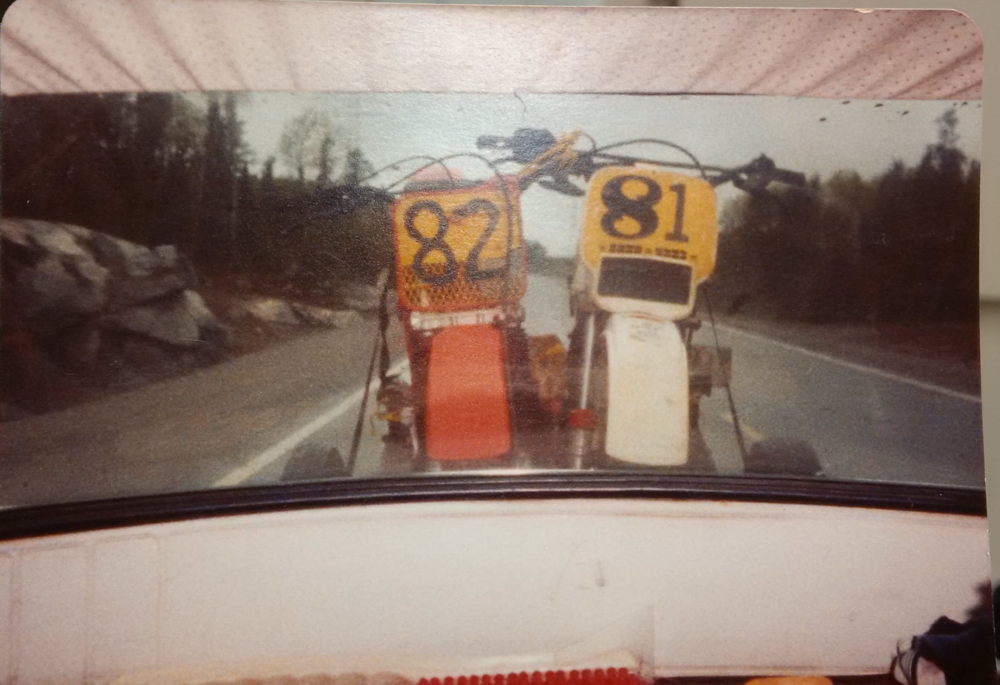

Just like I would have done back in '84, I woke early, jumped in the car and set out to the races.  And just like back in the day, I had two bikes in tow.  Many motocross racers in the 80s had two bikes; a 125 and a 250. If you wanted to run more than two motos in a day, your only option was to buy two bikes.  I never had the scratch to own two bikes, but I always had at least one brother to share racing adventures with and we would load up our bikes and drive off together.

{.img-responsive}
### In 1983 CMA assigned me 81 and Pat 82.  We would go off to the races in whatever vehicle we had at our disposal.  This is the view through the rear window of a 1967 Volvo four-door sedan.  See the fenders on the trailer?

It has been at least a dozen years since I sold my Yamaha motorcycle and bought a Yamaha guitar and while I have managed to log some seat-time on borrowed bikes over the years, I have not raced since. Now I have two bikes of my own.  One is the vintage RM-250 from 1984 and the other is a 2013 RMZ-250.  The plan is to race the old bike in the old-man class and the new bike in the slightly younger old-man's class.

The sun was up, the sky was blue and there was a lovely wind blowing.  I wheeled into KMMX at 8:15AM, just in time for rider's meet.  The pits were packed with fellow racers, their gear and crew.  I got my car stuck in the soft grass as I pulled in so I pitted right where the tires of my car started to spin.  I signed up to race +35 and +45, attended the riders meet and then it was time to practice.  The day was moving along, no time to spare. 

{.img-responsive}
### This has been a long cool and wet Spring.  This field is wet and the two cars you see are stuck.

As I am putting on my gear, an old racing friend Pete McPhail came over and said hi.  I saw Pete in Kamloops a couple years ago, he was spinning wrenches for Team MX-101 in the Canadian Nationals.  Pete also has an old RM-250, not vintage, it is still a great competitive bike.  Last time I raced with Pete, he was newly married and a recent father.  Now he has two kids racing motocross. Great to see old friends.

I decided I was going to practice on the '84.  I knew I could ride the new bike just fine, this old beast takes some getting used to.  I fired it up and headed track-side.  I had been to 