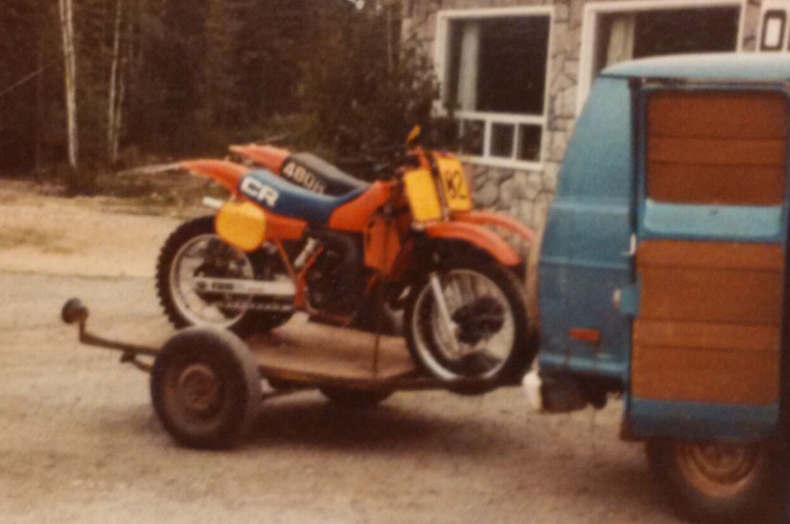

#### Back in 1982 I bought a brand new Yamaha YZ-250.  It was the first year that Yamaha used International colours for Canadian bikes.  Mine was white with a red seat and gold rims and it looked amazing.  The reason I bring this up is because this was the first time I had a bike fall off a trailer.  Yesterday was the second.  FUUUUUUCCK!

In 1982 this happened because of the way we tied the bikes onto the trailer.  Bernie and I just finished riding at Charleston.  He was riding his 1980 YZ-250 and we spent a few hours chasing each other around the in the red sand.  What that actually meant was that he would pass me like I was standing still, disappear, slow down and let me by again.  It is not as humiliating as it sounds. The guy was just that fast and he was doing what any good big brother would do... he was making me a faster rider. We had a decent home-made trailer that was built for a single bike but we would fit two on it and travel all over Northwestern Ontario.  

To accommodate a pair of Yamahas, we would put the bikes beside each other with the front wheels wedged into the tounge support of the trailer.  We would tie the handlebars together with a Quetico North bungy chord and run a tie-down from the outside bar of each bike to the corner of the trailer.

{.img-responsive}

### This is the old trailer a year later when we started riding Hondas.  We had new bikes, but we never had anything else that was new. 

Tying a motorcycle down to a towing vehicle is a remarkably simple task.  The force of the compressed suspension combined with the remarkable triangle principle results in a system that seldom fails.  But in 1982, the system did fail us once.  With two bikes, the tie-downs are at a wider stance and we no longer have a good solid triangle to work with- more like a parallelogram. So there we are driving home, we just left the pits and we are going fast through a curve in the road.  The front suspension compressed and the outside strap became loose and because we just used an open hook in the corner of trailer, the strap simply fell off and when we were through the corner, the bikes fell and started dragging on the pavement and on the trailer tire which had no fenders.  

Bernie was relieved that his bike landed on mine and received no damage at all.  Mine was scraped up pretty bad and the throttle control was destroyed.  We learned a valuable lesson that day.  We needed to secure the bottom hooks better when towing two bikes.  With the use of a yellow-wrench, we blasted some holes in the trailer to accommodate the lower hooks and problem solved.

That experience remained in my head until this very day.  Thanks to the trauma of that fine day in '82, I now know how to avoid such a terrible fate... or do I! 

{.img-responsive}

### I built myself a decent little trailer for my Vintage Moto RM250.  I bought some tie-down straps with a Caribbeaner lower hook that goes through a solid eyelet... This bike won't fall!

{.img-responsive}
### To make the system even better, I purchased these cool tie-down eyelets from Gnarly Parts.  This bike will never fall!

One thing I never factored into the equation was age-induced crappy vision or perhaps just plain age-induced stupidity.  I used to feel I was a pretty sharp guy when it came to most practical things, but now I often just feel mentally disabled.  The last time I decided to go for a ride I loaded up my gear, drove an hour to Limerick Forest, started gearing up and realized I forgot my helmet.... FUUUCCCKKK!  I just went home.  My front fender was about to break off anyhow so it was just as well.  This time around, I loaded up my bike, drove on down the road and the first big bump that I hit I watched my bike disappear from my rear-view mirror.  I jammed on the brakes and came to a very abrupt stop and surveyed the carnage.  There was my nearly-new 32-year-old vintage Suzuki underneath my trailer dragging by a single tie-down strap.

I didn't bother taking a picture from the scene of the crime, I was far too pissed off.  How could this happen?  Did an eyelet break?  Nope.  Did the strap break? Nope.  Stupidity happened. 

{.img-responsive}

### This is the stupidity that happened.  Can you believe it?  I am so angry with myself.

{.img-responsive}

{.img-responsive}

{.img-responsive}

### A few pictures to show all the scrapes and bruises on the old gem. The handlebars are bent, throttle is off and in rough shape, cable housing is stretched, seat is ripped, both fenders, number plates and the rad shroud.

When we built the bike, my brother Pat told me to buy some after-market plastic and store all this original stuff.  I guess I should have listened.  I don't mind a few abrasions normally, but this definitely hurts.

## So what is guy to do?

The answer is simple... ride anyhow.  I got a huge steel bar and bent the handlebars back to where they should be.  I repaired the throttle as best as I could and took off down the road.

{.img-responsive}

{.img-responsive}

{.img-responsive}

### Here you can see the before and after throttle repair.  The throttle tube is busted too, but it still worked and to my delight it was not sticking.

Limerick Forest as previously mentioned is an hour away, mostly highway driving.  I turned off the 416, which means about 5-minutes to go and I realize that stupidity strikes twice in the same day... I forgot my can of premix.  This was not going to stop me though, I can always go buy a new can and mix up another batch.  Fortunately though, the tank on the old Zook was already full so I was good for the day.  

I parked the car, there were a lot of cars in the parking spots, lots of guys and gals were taking advantage of the fine Fall weather.  I fired up the bike and the idle speed was about 4000 RPM. My stretched cable housing was going to prove challenging.  I screwed the adjuster all the way in and managed to get the engine to run down a lot lower, but it was still not coming to a full stop.  I turned off the engine and over-rotated the throttle a bunch of times and that helped some but I was going to have to adapt.  I got into the single-track and started to ride.  The trials of the day kind of melted away, all I had to do was focus on staying on the trails- and adapt to a bike that won't slow down.

This bike is stock.  For single-track, it would be nice to add a few teeth to the rear sprocket because first gear is a little fast in the woods.  This bike was also built before the advent of hydraulic disk brakes so they are comparably awful to modern bikes.  High-idle just adds one more thing to adapt to.  I have a high-geared, high-idling old bike with shitty breaks.  What could go wrong?  Well, as stupid as I have become in my old-age, my ability to ride a dirt-bike remains in-tact.  No bad things happened, I had a great ride. 

I have to confess though.  I love the old RM-250, it is really cool to ride a bike from my youth, but I am getting the itch to upgrade.  Don't tell Mrs. Vintage Moto though.  It handles great, the suspension works just fine, the power is awesome and it is so simple compared to modern machinery.  But the breaks are shit!  Every time I put on the rear brake, it would stay on for a second longer than necessary.  More adapting.  I will have to do some maintenance before I ride again.  The other thing I have a love-hate relationship with is the seat.  It is soft and comfortable, but the slope of it leaves much to be desired. I keep getting pushed to the front of the bike.  

<iframe src="https://www.google.com/maps/d/embed?mid=17o9uCHltNSae9hKAMypaYY1JoF8&hl=en" width="100%" height="480"></iframe>

### I got a new Android BlackBerry phone so I had to find a new tracking app.  I decided on LD-Log for $6.90.  No ads, no in-app purchases.  It has a ton of features, it took a while to figure it out.  Use Google Chrome if you don't see the map.

- I rode for 3 hrs., 36 minutes
- I went 35 km
- Max speed 38.8 km/h

I rode for while and then started riding with a large group of riders for a short time.  There had to have been 20 bikes all riding in a line.  I mixed it up with them for a short time.  There was another Suzuki rider sporting the number 81, it is not often you see that. I parted company with them to go to some of my favourite spots and after a good long time, I started making my way back to the car.  I stopped and chatted with a couple guys enjoying the trails.  

{.img-responsive}
### I stopped and chatted with the owner of this bike for a little while.  This is a 2014 TM Racing 450.  Hand-built in Italy.  Pretty cool looking bike.

Once back at the car I started chatting with my parking-lot neighbours.  Really nice guys.  They were all two-stroke riders.  One bike was a KX-250, another was KTM 200 XC-W.  The third bike was  KX-500.

{.img-responsive}

### That black beast is a KX-500 motor fitted into a modern KX-250 chassis.  What a beast.  Not at all practical for Limerick Forest, but hats-off to him.  It is a great build and he rides it well.  It is for sale too.

I was contemplating going home.  I was supposed to be at the in-laws for family dinner but these Brockville boys were doing a loop in the South end and asked if I wanted to join them.  How could I refuse?  Hmmm... Dinner with the in-laws or another hour of dirt-biking?  I chose the latter and am I ever glad I did.

I am bad with names, I know Adam was riding the KTM.  The 500-guy was low on fuel and so was I so we had to be mindful.  We set off and hit some gnarly woods.  Struggles were encountered by all. We soon found the riding order that worked.  Adam was in the lead and I tried my best to stay on his tail.  We gave each other a hell of good run.  It was all I could do to stay with him, but I did manage. I think they got a kick out of my struggles.  When waiting I would have to hold my throttle cable in to prevent the bike from idling too high.  The skinny foot pegs were also something to behold.

For a day that started off badly, it sure did end on high-note.  I made some new friends that I hope to hook up with again with soon.

### I don't want to grow up - Tom Waits.

 