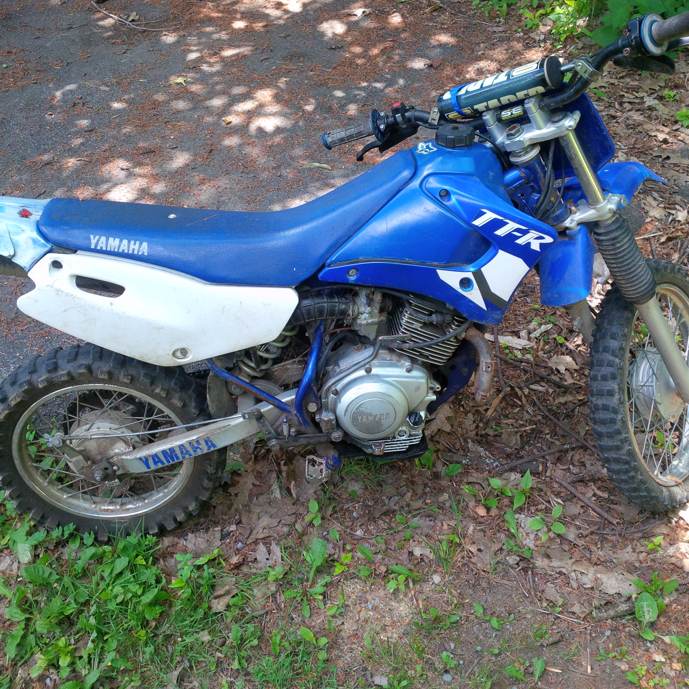
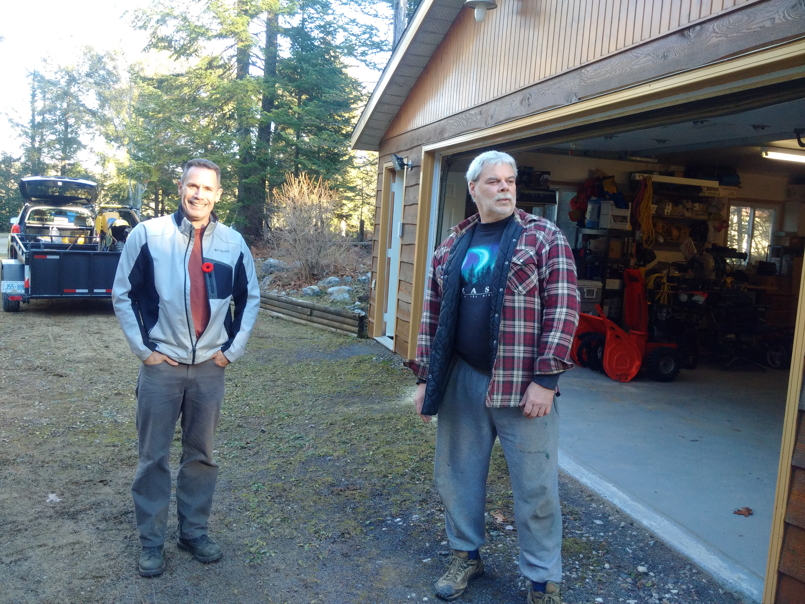

## I am now a Vintage Motocross Racer!  

Actually, I have yet to enter a vintage class race, but I will next year as I plan to attend at least one race.  So how did this come to be you ask, it happened gradually.

I have been a motocross racer on and off since I bought my first true motocross bike in 1981 at the age of 15.  Prior to that I spent several years riding dirt bikes on the logging roads near my home. Dreams of becoming the next Ross Pedersen were never going to come true for me so I allowed other distractions to become more prominent than motocross.  Over the years I got into and then out of the sport but I have been bitten by the moto bug and once bitten, it is in your blood for life.

**A day at the races...**  
In the summer of 2013 I went to watch the Ottawa round of the Canadian Nationals at Sand-Del-Lee and while walking through the pits I saw what looked like a brand new 1980 Yamaha YZ-250.  Seeing that bike got me to thinking, you see my brother Bernie Cox had that exact bike back in 1980 so I snapped a picture and started daydreaming about days long ago.

{.img-responsive}
### A 1980 YZ-250 got me to thinking, maybe I am a vintage motocross guy

**Facebook...**  
I have an on-again off-again relationship with Facebook, sometimes I get a lot of enjoyment from it, other times it drives me mad but what it is good at is pushing people toward their interests.  I followed or friend-ed some motocross friends of mine which caused those messages to show up telling me I might be interesed in Vintage Motocross.  Do you suppose it is some kind of algorythm that says "here is an old guy, maybe he will like old dirt bikes"?  Anyhow, there are a lot of Vintage Moto groups on Facebook and I followed one.  It is a very active group and I keep seeing old bikes that have some meaning for me.

**On a break**  
I got into motocross again until about the age of 40 when I stopped abruptly and took up playing guitar.  I sold my Yamaha motorcycle and bought a Yamaha guitar.  You might think starting guitar at age 40 would be a non-starter, but you would be wrong.  I love it, I will never be good at it, but it does not stop me from really enjoying it and it has led me to meeting so many great new friends just like motocross did. 

But while on this break, my brothers continued to ride and speak of their adventures.  Motocross friends like Mark Hurst and Rick Wall would invite me out to ride at Sand-Del-Lee.  My neighbour Rob Kern is an enduro rider and that prompted me into buying a KLX 250 to goof around on and a small TTR 125 for the kids.  The KLX was fun, but I sold it and decided to just stick to the music hobby as it did not scratch the moto itch which left me with a kids bike as my only motorcycle... and that just won't do.

{.img-responsive}  
### Having the wrong motorcycle in the yard is just silly, it makes much more sense to own something I might actually get some use out of.

**kijiji**  
So the vintage motocross bug was planted and rattling around in my brain and the unusable bike in my yard prompted me to visit kijiji.  At first I was just looking to see what I might get for the TTR but then I started looking at old bikes.  I decided that if I were to get some vintage iron, it would be an RM-250 so I did a search for just that: "RM-250" and an ad for a mid-80s model came up with an asking price of $750. 

I sent an email to the man and told him that his bike was a 1984, I could tell by the picture what the year was. I told him to email me if it did not sell in a week giving me time to sell the TTR.  I put the TTR up for sale on kijiji asking about half what anybody else asks for similar junk and by Sunday it was gone. 

No sooner had the TTR left the driveway, I sent another email to the RM-250 owner who lives in Low Quebec about 1.5 hours away. I got a fast reply, he still had it so I rounded up my neighbour Rob Kern and off we went.

{.img-responsive}
### It happend fast, I sold the TTR for $500 and bought the RM two hours later for $700. The same price I paid for my 1979 RM-250 in 1981.  

