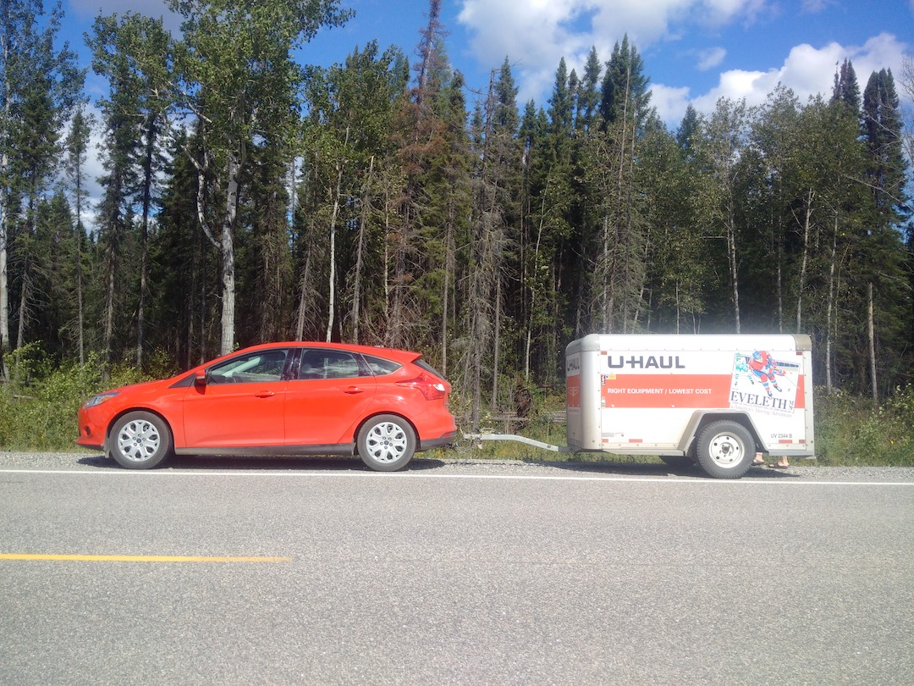
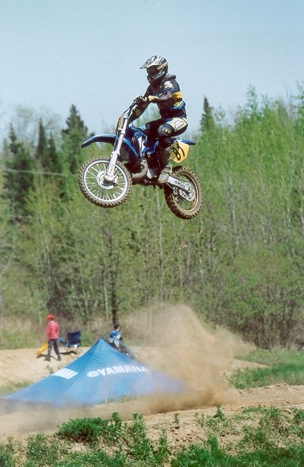
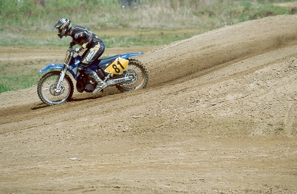

## I know for sure you can fly 110 feet without any problem at all.

Last summer my nephew and his bride had their wedding in our hometown.  Since buying the old '84, I had really been looked forward to taking it to the track where I cut my teeth as a young motocross-crazed kid.  

### Cut to the chase... Here is a video I made showing the old bike flying over the biggest jump on the track.

The track is called Charleston.  It is named after the company that used it in the iron mining business back in the mid-20th century.  Iron ore would be washed and the sediment would collect in a large pond.  Once the company stopped this phase of their operation, the water was drained and what remained was the best motocross track in the near-north.  Deep, deep heavy iron sand that provides limitless dirt bike opportunities and copious amounts of traction-especially after a rain.  The only downside to the charleston dirt is the red colour.

I think most of the streets of Atikokan were built using this red sand and while it has lost much of it's bright lustre, back in the day, it would stick to and stain everything it made contact with.  When I was a kid, all the streets in town were red from the iron mines.  Once the mines closed, the red streets returned to a more traditional neutral colour, but Charleston still turned everything red.

{.img-responsive}
### This is 1984 at a Charleston race.  You can see that red dirt.  Out-of-town racers loved the track but complained incessantly about the permanent stains to their plastic and aluminum parts-not to mention their clothing and nasal passages.

It is really hard to find a picture that really does it justice, but we always had the ugliest bikes at the races.  It seemed no matter how hard you scrub, the bikes still look bad.  It is now thirty-three years later and the oxidized iron sand no longer stains like it did back in the day so my restored 84-RM looks no worse for the wear.

My brother Pat helped me put the bike together during his vacation in March and when we were complete, we were not able to start it or ride it.  He was really looking forward to trying the bike out just as I was really looking forward to spending some time on a proper motocross track.  I [was turned away from Sand-del-lee on my birthday](http://vintagemoto.ca/notes/a-ride-to-celebrate-51-years-on-earth) so I had only done a few laps of actual motocross on this old bike.  I rented a U-Haul trailer and towed my stuff 1700 km there and another 1700 km back burning twice as much gas as I normally would.  It burned so much gas that I carried a spare jerry-can just in case. And I used it twice!

{.img-responsive}
### Not exactly the best towing vehicle, but it got the job done.

Going out to Charleston for a ride was one of the first things we did upon arriving in Atikokan.  Pat and Mac (the groom) had already ridden a couple days before I got there.  They had the track dialed in probably within 10 minutes of arrival.  They were hitting every jump on the track - "nothing to it" they said.  I got out on the track and started doing some laps.  I felt comfortable and the bike worked great.  

{.img-responsive}
### Here is Pat and his son Mac.  Mac is the reason we gathered in Atikokan... he chose to have a wedding that centred itself around dirt-bikes and the great outdoors.

{.img-responsive}
### Me in foreground, my two nephews - Mike and Mac and some of their friends.

{.img-responsive}
### Pat, Mac and myself pounding some laps at Charleston.

Pat and Mac were really riding well, but Mac was especially fast and smooth.  I was thrilled to see him riding so well.  He would carry a massive amount of corner speed and to me that is what really separates the men from the boys.  But he was not only strong in the corners, he was good everywhere and as I already mentioned, he and his dad were already hitting every jump on the track.

One of the jumps is 110-feet long if you pace it out.  If you really air it out, you will probably go more than 120'.  This was not the most challenging jump on the track, but it certainly was the most intimidating just by its sheer size.  There is a long stretch leading up to the ramp and the faster you hit, the softer the landing.  I was not out to prove anything though, I was happy to just ride so I was shorting it and landing hard but safe.  

We started to swap bikes and first up to drive my vintage bike was Pat and on his very first lap, he nailed that big-ass jump and flew right over for a perfect landing.  The bike flies just as well as a new one.  Balance was perfect, no unpredictability at all.  Next on the seat was Mac and of-course, not one to let his dad keep the upper hand, he also nailed every jump on the track first lap.

{.img-responsive}
### Mac's wife Arren had a great camera and she took most of these pictures.  Rightfully, her subject was of her man.  Here is Mac with his famed corner speed caught on camera.

I have always had a bit of a fear of flying on my motorcycle.  I was known to be a pretty decent rider usually finishing on the box whenever I raced, but I was not real comfortable on the jumps.  This fear was likely the result of my '79 RM250 when I was 14-years old.  That thing spit me off many times-rider error, poor setup, bad suspension? who knows.  I blamed it on Suzuki and then bought a Yamaha.  

When I did get my riding chops, I still found keeping my wheels on the ground was faster than flight.  I clearly remember developing in my mind what is now known as the Bubba scrub.  I never did scrub though. I just had a vision in my mind that it would be much faster to lay the bike on its side while on the ramp and flying a smaller distance in order to get back on the gas and pull another gear or two.  I always felt James Stewart stole the move I was always afraid to try.

{.img-responsive}
### This is James Stewart riding his 125 back in his early days.  This is a great example of his signature move known as the Bubba Scrub.  I found the image on Google Images but I believe it was taken by [Chris Tedesco](http://tedescophoto.22slides.com).

My brother Pat on the other hand was the opposite.  He had no fear of flight as far as I could tell.  We had a jump at Charleston called the Rocket Launcher and he would hit that thing and sail to the moon.  I wonder how far that jump would toss him?  I bet it was over 100 feet.  One time in a race, Pat pulled a massive holeshot on his CR-480 and headed over the Rocket Launcher.  My brother Bernie who dropped the gate for the race was in a perfect place to see it all go down.  After the race, Bernie famously commented "When Pat pulled that holeshot and sailed over the Rocket Launcher, there was a total eclipse of the sun".

{.img-responsive}
### This picture is 1988 and the bike belongs to Asko Natti.  Many years after this picture was taken, Pat would own this bike.  In the background you can see what we referred to as the bird cliffs. While the Rocket Launcher cannot be seen and may not even be there at this point, that's where it was in the early 80's.  We essentially pushed down the bird cliffs to form a ramp that went from the bottom to the top and the more balls you had, the farther you flew.  Pat definitely had balls and so did Bernie and Jim for that matter.

I was not totally scared of flying, the more you ride, the more comfortable fight becomes.  Usually by mid-season I would be doing all kinds of crazy stuff.

{.img-responsive}
### I always liked this picture, it looks like I am about the fly of into the great unknown.  It is a just a pile of gravel with a ridge near the top.  I would hit that and turn the bike in mid-air and come back down.  Very fun, but pretty tame in reality.

{.img-responsive}
### This is the same picture but I photoshopped out the trees to add drama.

{.img-responsive}

### This is the same spot from a different angle.  These pictures were taken by Mark Hancock who is still riding and fast as ever.  The bike is my 1984 CR-125, the location is behind Marion Lake.

In the early 2000s I started riding Motocross after a long hiatus.  What I found when getting back out there is that the jumps were way different now than in the Rocket Launcher days.  Back then, we made jumps where we found piles of dirt.  Now, the jumps were made with bulldozers and high-hoes.  They are bigger with steeper ramps that send you higher into the sky.  If you are not hitting these big monsters, you are not winning races.  The other thing that I found disconcerting was the double and triple jumps.  The penalty for error just seemed so big.  I was timid as can be.  I was fast in the corners, smooth, good in the rough but I was not hitting the jumps.  It took me forever to build up my nerve, but eventually I did get the hang of it and really learned to enjoy it.  The key to modern jumps is the landing ramp.  If you hit it too slow, you have a hard landing, if you hit too fast you overshoot and have a hard landing.  If you hit the landing ramp, you hardly feel the landing.  It is easy on the body and easy on equipment.  But the penalty for error is high.

{.img-responsive}
### Me in 2003 on my YZ-250.  I bought it new and really enjoyed it.  As you can see, I am no longer timid.

{img-responsive}
### This is me jumping the 70' table top at Sand-del-lee.  It was an intimidating jump as there was not a lot of run to get to the ramp.  Looks like a hard landing, but I am on the down-ramp. 

Back to Charleston in August 2016.  After Pat and Mac flew my bike over those big jumps, it was now up to me to get brave and do it too.  I kept hitting that jump and deliberately slowing down and short-landing it.  As mentioned above, that is hard on the body and bike.  What I needed was some kahunas like Pat and Mac.  The more I rode the more comfortable I became and on one lap Mac caught up to me and was riding behind me.  He had his GoPro on his head so it was a perfect time to pull the trigger.  We came out of the turn before the jump and roared toward the jump... second gear, third gear, fourth gear throttle wide open.  I nailed it and flew even farther than Mac did.  I was thrilled.  I was jacked with adrenaline and quite please with myself.  That jump is big, but it is predictable.  The ramp is nice and the landing is nice so in the end it was not a big deal.

I started to hit that jump more regularly and by the following day, I was hitting it every lap and I was also hitting the more technical jumps as well.  On my second day of riding, my nephew and Mac's older brother Mike was riding.  Mike has become a phenomenal trail/enduro rider by riding in the mountains in BC.  But Charleston was intimidating him.  That big jump was not his move that day.  Mike likes to spin a good tale and I heard him tell his riding tales to a few people.  

#### "So I am at Charleston riding around and I hear this buzzing behind me.  The next thing you know, my 50-year-old uncle on his 35-year-old dirt bike goes flying over my head.  I had to pull over and see where my balls were!"

Thanks Mike, that made my day.  

### Lets finish this story with a video of some dunes riding.  I have ridden in Arizona, but not in the dunes. These guys are hitting really big air.  No shortage of this stuff on YouTube.

