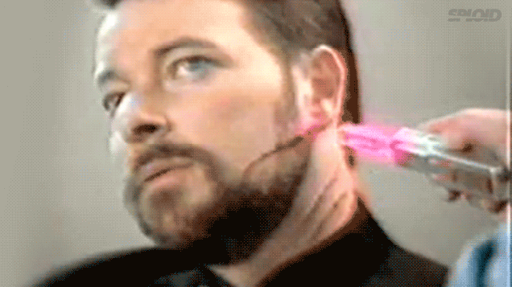

I am skipping over a few adventures and writing a short story about a great day that I had riding motocross and meeting some new motocross people.  

===

The main photo above is the most dirt I have gotten on the old '84 RM250. How did this happen?  How did I manage to finally get my dirt-bike dirty?

If you read my last story about my [birthday ride](http://vintagemoto.ca/notes/a-ride-to-celebrate-51-years-on-earth), you will recall that I had a bad day.  The fine folks (they truly are fine folks) at Sand-del-lee would not take my money.  They wanted more money than I was willing to pay so I left angry and went in search of a place to ride. A few days later I got an email notification about an upcoming race at a place called Kennelly Mountain Motocross located near Renfrew.  Renfrew is close by my standards and I wondered if this was a track open to the public.  A little digging and I found their [Facebook page](https://www.facebook.com/KennellyMountainMXRace/) which I "Liked", I read all there was to read, looked at the pictures and videos to discover that it is not open to the public, but they do hold some races there.

A month or more passed, I had some excellent motocross adventures with my family in my home town but that is part of a larger story I will write about later.  A little over a week ago I got a notification that KMMX was having an event "Fall Ride Days" where for $30 anybody can go and ride on their track just for fun. So that was all I needed to know- I knew where I would be on September 17th.  I actually got pretty excited about it.  Every day I was thinking about what a great day I was going to have.  

On Thursday I decided to get my bike ready.  All I needed to do was to clean the red Charleston dirt out of the filter and give it a quick power-wash. So I loaded the bike on my little trailer that hadn't been used in weeks and towed it to the Marina where I work.  I got a flat tire on the trailer so I had to go home, get my spare and change it out on the side of the road.
Perhaps an omen for what was to happen later that day.  Actually, an omen would be a message referring something beyond my control.  What did happen was pure stupidity on my part.

{.img-responsive}
### Oh yeah... road rash and I have no excuse for this one. This was pure stupidity.

I put the bike in the shop at the marina and cleaned the filter, checked things over a bit and put it back together.  I fired up the bike and drove out to the end of the pier, I turned around and did a wheelie for the boys.  I over-rotated, all I needed to do was tap the rear brake, but instead I threw it away.  I don't know why.  Perhaps it is because I watched a video of an old guy on an old bike like mine ride all over his fields someplace down in Georgia.  He rode the whole time on his rear wheel.  I have never mastered that kind of wheelie.  I suppose I am a pragmatic wheelie-er.  I wheelie over obstacles, I wheelie for my own enjoyment, but I don't do it to show off.  But as I did this wheelie on the pier at [Port of Call Marina](http://www.portofcall.ca), I was going slow, the front end was real high just like that guy in Georgia.  I thought for the briefest of moments that I was that guy who could do those fender dragging wheelies without going over so I kept it in the air for a little longer and then threw it away.  I fell down, got a bruise on my butt and a little road rash.  Punishment.  The bike was not hurt. I had to put the rear fender back in place and bend the cheese-steel OEM 32-year-old bars back straight.  No big deal, just stupid and if I actually gave a shit, it would have been embarrassing.

### Oh how I wish this future was here!

Friday was a lovely day but bad weather was looming and threatening to wash out my KMMX plans.  I consulted with Mrs. Vintage Moto who knows how to read a little deeper into weather forecasts. She figured if I got there early on Saturday, I could ride for a couple hours before the rain started. I also figured that because this was taking place on the top of the biggest hill in Ontario - or close to it, it may have its own weather patterns.  As it turns out, I was right, their weather does not always jive with the forecast.  It was raining when I got there at 9:30 but not much.

When I arrived, there were already a few bikes tearing up the track.  They had safety spotters located at different areas and the ride day was under way.  I went to the house to sign the waver and part with a small amount of cash for entry.  We engaged in some chitchat about each other.  KMMX is owned by a motocross family.  If I was good with names, I would mention them all, but mother was Sherry, the son was Colin.  There is also a daughter and a father of course and this is their hunt camp.  They built the motocross track for Colin to practise on and later opened it up to the public for race days in conjunction with MX101 who run Sand-del-lee.  

{.img-responsive}

### This is Sherry and her husband.  When I figure out their names I will edit this so it is not so impersonal.  Wonderful people who were grateful to have me show up for the day.  This picture was taken from their Facebook page and was from a race day that they had.

{.img-responsive}
### This would be Colin.  A really nice young man making a nice turn at KMMX. I enjoyed talking with him and it would seem most others do as well as he made the rounds.

Sherry asked me if I was the guy on Facebook with that really awesome old vintage bike.  When I "Liked" their page, she checked my page and saw pictures of my old bike.  She was genuinely pleased that I was there with my old bike.  It was actually pretty cool to have this recognition, her family loved the old bike.

I went back to the car, unloaded the bike and put my gear on.  The rain had stopped.  More people came over and introduced themselves.  Everybody seemed enthused about the old bike and they were pleased to meet the old guy riding it.

Kennelly Mountain Motocross Track is located right at the top of Kennelly Mountain.  We don't have big mountains here in Ontario, but it was quite a climb to get here all the same.  My ears popped a couple times on the way up so I was pretty sure this was going to be a track that has elevation change.  And it does.  

{.img-responsive}

### Another image borrowed from the KMMX Facebook page.

The starting gate is at the bottom of the track, you have to follow a trail in behind the house to get there. The terrain is a sandy soil and even with the rain, it was not muddy. Once under way, you climb the hill and there is a small launch where you land in front of the pits.  From there you continue up the hill.  There is a small table top that you have to slow down for or you can scrub it if you have that move.  After that it is more climbing and you launch off another jump that is kind of sideways but in a totally fun way.  Upon landing that, you continue up and then turn back down the hill where you are met with a very challenging off-camber turn in the power-robbing deep soil. I found this to be the biggest challenge and I never did get through it as well as I would like to.  After that, you go up to the top of Kennelly Mountain and there is nice long straight stretch and then you meander your way around up and down the hills, through some huge berms, over some safe jumps and eventually you make your way back to the bottom where you start from.  A lap takes about two minutes and it is fun and challenging.

{.img-responsive}
### This is another picture I borrowed from Facebook and it show just how nice it is at the top of Kennelly Mountain and the kind of dirt there is.

About the only bad thing I can say about KMMX, is that there are some rocks in the dirt so if you plan on riding behind the 450s, be sure to wear a chest protector.  The owners do a great job of clearing them off the track but when you get a couple hundred bike-laps, more are bound to appear.  It is just part of the sport.  

So I had a great time.  I rode four or five times and each time out I did about 4 laps.  I rode fast, I was able to keep pace and even pass a few guys.  I also got passed a few times.  With motocross I find I am always faster than some and there is always some faster than me.  Now that I am over 50 and my bike is over 30, there are even more people passing me but I am just fine with that.  I did fall a couple times. I did a dumb move where I passed a guy but didn't have room to pass another kid on an 85cc so I had to grab hard on my shitty brakes and lay it down.  I rolled onto the track and fortunately, the guy I had just passed was smart enough to hang back and watch me flounder so he didn't run me over.

There were some really fast riders out there that day and some newbies.  KMMX is filling in a hole for people in the area who need a place to ride.  I wish it was the sort of place where I could just go whenever I wanted but this is Eastern Ontario and places like that no longer exist.  I am too stiff and sore now to ride so I am guessing that is the last time I ride there this year, but I will be back.  

{.img-responsive}

