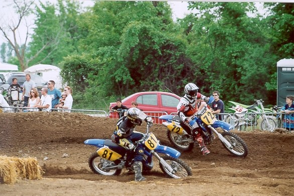

*Photo credit: https://transmoto.com.au/throwdown-no-74-the-pass/*

An English riding stable is not a typical breeding ground for a motocrosser. My parents parents wanted me to be a part of their dream of owning and operating a farm dedicated to their horses, however I showed no interest. A deal was struck. If I committed two years of my life to riding horses, then I could have a dirt bike. I rode horses in all types of shows, cross county and summer camps. I attended pony-club and even fox hunting to please my parents. I now realize my parents believed I would fall in love with horseback riding and give up my obsession for motocross.

When the TV times schedule read "suppercross" all my chores would be done to earn the privilege to watch Ricky Johnson ride in the Saturday night Supercross. I would sit an unhealthy distance from the TV and I would study closely the lines and riding techniques in detail. I counted the days until the day I could ride wheels instead of hooves.

It was 1980 and my contract was up. I got my first bike as promised.  It was a brand new 1981 Honda Z50. It had to be a Honda because that's what Ricky rode. I practiced every weekend and every day after school on a track I dug and built by hand. 

{.img-responsive}
### My first bike looked a lot like this.

It was no secret that I wanted to race! My father heard of a local track and agreed to take me for the Sunday race. We loaded my bike in the back of the truck and left for the race. We arrived late and open practice had already started. I could see it, my face was pressed against the glass as my heart pounded in my chest. My father who knew nothing about the sport was completely shocked when he saw the enormous swarm of bikes on the track all at the same time. It must have looked like total chaos to my father as the truck never stopped. He just did a loop around the parking lot looking for the exit shouting "not as long as you live in our house" and we left- I was devastated.

18 years later I was approached by a guy who was leaving the country for a job offer and was selling everything he owned with only a weeks notice. Thinking I could make some easy money and flip a dirt bike I agreed to look at it. I bought the 10 year old cr125 as I knew it was easily worth more than double what I paid. After I got the bike home and rode it to make sure it was sound, I was hooked. All dirt bike riders know the instant gratification you get when you ride. I decided to go to the local track to ride it just once- just so I could say I rode it. Big mistake! I instantly found a support group to help me become an addict. They filled me in on the process and encouraged me to show up on Sunday. 

{.img-responsive} 
### This is much like the bike that finally hooked me for life.

I followed their advice and as I drove into the pits they greeted me as if they were not going to let me back out. Any chance of changing my mind and backing out were now gone. I signed up to race vet-master class as I was now 27 Years old. Having not ridden since my z50 I assumed it was the right class for me. I Was so wrong, they were extremely fast. It was too late though, I was completely addicted. The next three years I raced every single weekend all season long- traveling to races spanning three provinces and six states. My third weekend of racing - as I found out after I arrived - was a the Canadian Nationals. I finish 9th over overall in the junior class. This only fueled my addiction and drove me to race as much as humanly possible.

My parents would comment later that they wished the had known more about the sport when I was young rather than me living the dream trying to qualify for the Toronto Arenacross at age 34.  I was thankful I started at 27, I might have done it all at a much later point in my life instead. When I am riding its always the best best time of my life, regardless of my age.

{.img-responsive}
### In 2003 I met an old friend at the Motocross track.  #81 is Mike Cox - curator of this website. Front wheel in one rut, rear wheel in another and foot in yet another while I cruise around him on the bowl of the berm.  Many good times riding, racing and now writing. Motocross is for life.

### \#172

