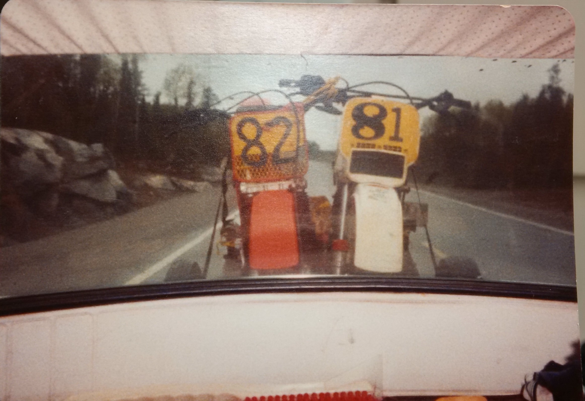

I went a little overboard with the bike graphics.  I normally would not care in the least what graphics are on the bike, but now I seem to desire some personalization.  Number 81 is my sentimental favourite number.  In 1983, that was my assigned racing number allocated by the Canadian Motorcycle Assiciation (CMA).  My brother Pat was asigned number 82 and along with Bernie and Jim, we all did some racing that year.

{.img-responsive}
### Pat and I on the way to the races in 1983 as seen through the rear window of a 1967 Volvo.

When I restored the old '84 I did not think twice, I put 81 as the number so it only makes sense that my new bike also sport the same number but in the opposing colour scheme of white on black. All I really wanted was a set of numbers, but I opted to spend a few extra dollars and do the rad shrouds and swingarm too.

I brought the bike down to the marina to work on it. I have a bit of a workshop at home but it is in my basement. I would have to take the bike apart to get it down the stairs.  My trailer is buried in 16-inches of ice and snow and blocked in behind a 7-foot high snow bank so I had to drive the bike to the shop by driving 3-KM down the Ottawa River and I made it just as the rain started to fall.

I read in my owner's manual that you can find how many hours are on the 2013 RM-Z250 by connecting a battery and a test light.  All you need to do is buy the connectors from Suzuki.  Instead I looked up on the Internet how to make your own. 

#### I found the following instructions on the [VitalMX forum](http://www.vitalmx.com/forums/Race-Shop,42/Reading-engine-hours-on-13-RMZ-250,1270680) posed by Slamdrew

Ok, I figured it out. Hopefully this will help anyone google searching for this info like I was. I would think a 2013 RMZ 450 would be the same, but this was done on my 250 to read original hours on the bike. You'll need a second person to make it easier. 

I just got a little 12v LED bulb, an old 12v motorcycle battery, and some wire. Oh, and a digital stop watch. 

> For me, I used a regular Snap-On test light instead of the 12v LED bulb.  Any bulb will do.

Unplug your fuel coupler and wire the light bulb between the red and white with red tracer wires. 

{.img-responsive}

Then, on the right side of the bike remove the blank plug of the black 2-pin connector. Wire the negative side of the battery to the black with white tracer wire, and the positive to the red wire. 

{.img-responsive}

When you put power to the black plug the test light will light up first to show it is working. Then it will shut off and light back up again. The second time it lights up is when it is displaying your engine run time. Every .2 seconds the bulb is lit = 1 hour of run time. (one-second is five-hours) Start the stop watch when it lights up, and stop it when the light shuts off. I did mine a couple times to get an average. For example my bulb recorded 2.4 seconds, so I have about 14 hours on my bike.

It should also be noted that the Suzuki 12v connector has an inline fuse in it on the positive side. I didn't use any fuses. Just be very careful where you are putting power.

Hope someone finds this useful.

---

So I did find that very useful and my light stayed on for 11-seconds so my bike has 55 hours on it which falls right in line with what I was told by the previous owner. I checked the valve clearance, it was well within specification so I decided I would not tear down the top end this year, perhaps next winter.

I took apart the rear suspension components and swingarm and greased all the bearings.  They were all in great shape but it was time for a lube.  I changed the oil, increased the pre-load on the rear shock and I am ready for spring.

Installing the new graphics was a bit of a pain, but I did a fairly good job in the end.  Not perfect, but good enough, it will look a lot worse after a few rides anyhow.

{.img-responsive}

{.img-responsive}

{.img-responsive}

{.img-responsive}

{.img-responsive}
### So friends and family, if you want to go for a ride, I now have a guest bike.  I will ride the vintage one the newer 4-stroke is the buddy bike.

