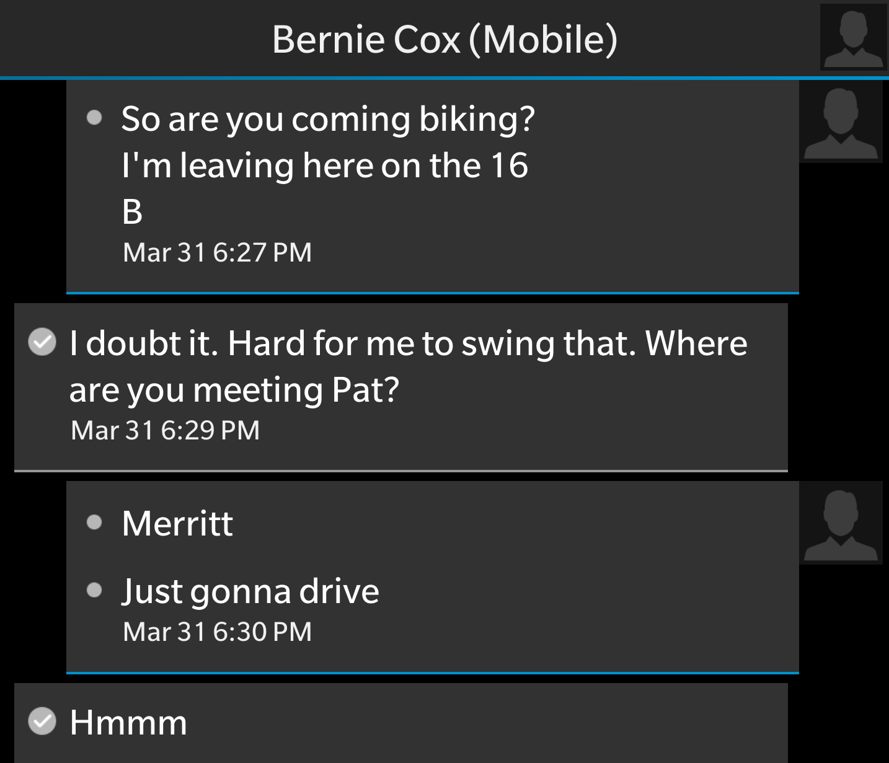
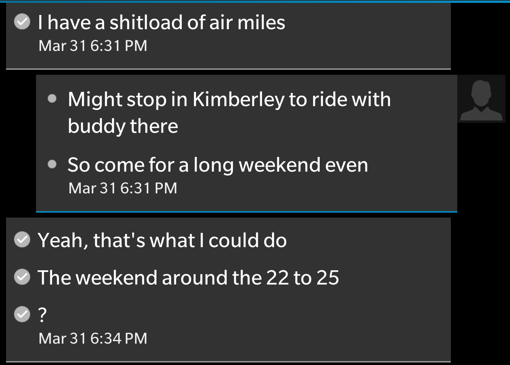
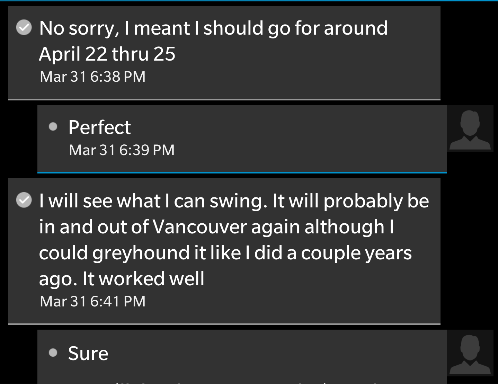
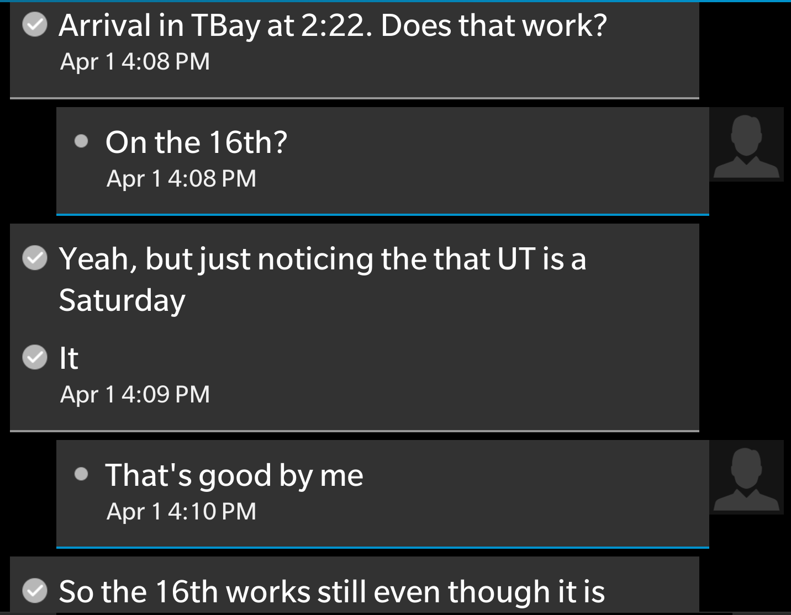
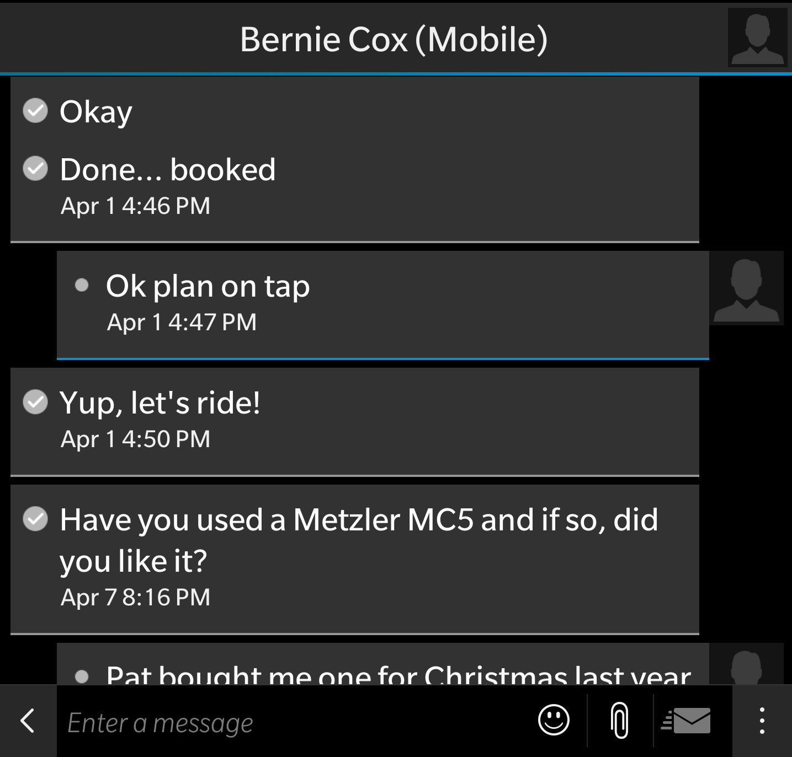
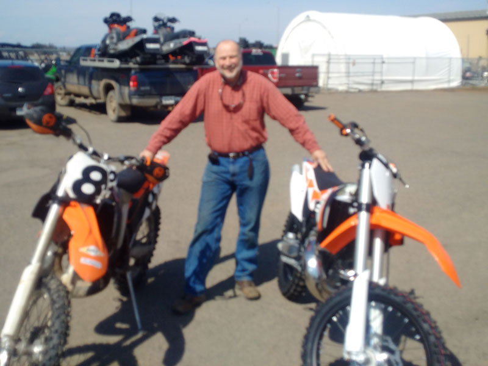

### Three years in a row makes it an annual event.

In 2014 my daughter Rose and I went to BC to spend time with my brother Pat, sister Cathy and their families in Merritt BC. For me the highlight of the trip was immersing myself in the dirt bike lifestyle in the hills near Merritt BC.  [In 2015 I went again](http://vintagemoto.ca/notes/the-epic-multi-generational-bc-dirt-bike-adventure-of-2015).  This was to be a more complete family reunion where all of our dirt-bike riding family members would gather.  It was another great vacation except I immediately wounded myself as did my nephew Mike. 

In March of 2016, the idea of another trip to BC had not even entered my mind. I was sitting my my car biding some time when the following text conversation transpired.

{.img-responsive}  
{.img-responsive}    
{.img-responsive}    
{.img-responsive}    
{.img-responsive}

The initial idea was to go down for a long weekend, perhaps just 5-days.  But Bernie was driving to BC by himself and I thought to myself, "when am I ever going to get another chance to drive across the country with my brother?"  So the long weekend turned into 10-day adventure. I booked one flight to Thunder Bay where Bernie would pick me up at the airport and I booked a second flight home from Vancouver 10-days later.

I didn't leave myself with much time to plan, there was not much to plan anyhow.  The whole trip was rather spontaneous.  I was not planning to go again, instead I was going to get my dirt-bike fixx at home this year by riding my newly-restored 1984 RM-250.

On April 16th at 2:30 I was greeted at the Thunder Bay airport with the smiling face of my big brother.  "Grab your bag and let's go" he said.  "I have a present for you".  We jumped in his old Yukon Denali with it's large covered bike trailer in tow and drove across the road to Excalibur Motorcycle Works.  We walked in the door and we are greeted with: "He's just finishing up, he will bring it around front for you".

Moments later the "present" was revealed.  It was a brand new 2016 KTM 300 XC.

{.img-responsive}
### Located across from the airport in Thunder Bay is big-boy-toy store Excalibur where a brand new KTM 300 XC awaited our arrival.

The plan prior to this moment was to drive to Kimberly BC to meet up with Bernie's friend Jordan Hatch where we would take turns riding with Jordan on Bernie's bike.  Even with Bernie and I tag-teaming on a single bike, there was little chance of tiring Jordan Hatch so the plan was sound.  We would have an abundance of machinery upon arriving in Merritt anyhow so sharing a bike was only going to be a minor inconvenience.

But a minor inconvenience just won't do in the eyes of Bernie Cox.  He swung a deal with Excalibur.  He traded in his 2014 KTM for a 2016 KTM but deferred the trade for two weeks. We got to keep the 2014 and the 2016 was to be mine to break-in.  Life just does not get any better than than that!

{.img-responsive}
### New bike and old at Excalibur, getting ready to load up and go. Adventure awaits. 

Bernie's old bike was already set up for him with skid plate, bark busters, pipe protector, grab-straps, bar-risers and the suspension was set up for him too.  This means that I have to make the great sacrifice of riding the brand-new bike but hey, beggars can't be choosers.

With the new bike loaded into the trailer, we were ready to hit the road and put some distance behind us.  Thunder Bay is in the middle of Canada, and driving to the left-coast is going to be a substantial drive.  We stopped at Tim's on the way out of town. The weather was great, the roads were clear and the driving was easy going.  Our first stop was for dinner at the famous Buster's where they serve world-class ribs and of course wild blueberry pie.

{.img-responsive}
### A quick stop for some Ribs at Buster's and it's back on the road again.

We pushed on down the road.  The weather fluctuated as much as the scenery.  In Manitoba the snow started to fall and just after Winnipeg we stopped for the night and started driving again in the morning.  We crossed the prairies. First Manitoba then Saskatchewan and into Alberta.  We used our cellphone for GPS a few times to help navigate but GPS is only good at navigating where you tell it to go.  

For some reason we had it in our heads that we needed to go to Calgary.  When talking with Jordan, he mentioned that Calgary was only four and half hours from Kimberly so off we go to Calgary which is where we stopped for the night.  Half way between Medicine Hat and Calgary we got to thinking... Why are we going through Calgary?  We could have stayed south and went directly to Kimberly through the Crowsnest pass. I blame this lack of fore-thought on getting older.

We got up in the morning, had breakfast and pushed on down the road, we could both taste the destination.  We were in the Rocky Mountains now and it was just a few short hours to reach our destination.  Going from Calgary to Kimberly with its breathtaking beauty made for a great drive. 

{.img-responsive}

{.img-responsive}

### We didn't stop for long, we have dirt bikes in the trailer and we are really getting close to riding country.

We made it to Kimberly fairly early in the day and we also gained a couple hours of daylight by driving west.  We drove to where Jordan lived.  We would be able to stay at his place but it made much more sense to find our own accommodations.  There is a ski resort in Kimberly and the ski season had just wrapped up.  There was still snow on the mountain, but the hill had been closed for a week or two by the time we arrived which really worked in our favour.  Accommodation prices were greatly reduced and we were able to rent a two-bedroom slope-side suite for about $120 per night.  The place was to die for.

{.img-responsive}

### We got a great post-ski-season deal on lodging at Trickle Creek Lodge.

{.img-responsive}

### Deck overlooking the ski hill

{.img-responsive}

### Full two bedroom suite

{.img-responsive}

### Pool and hot tub for aprez-ride

{.img-responsive}

### The restaurant at Trickle Creek is a Montanas where we met Jordan for dinner.

After getting ourselves checked in at Trickle Creek, we had a short nap and then it was time to prep the bikes for the riding the following day.  The new bike required some setup.  We put an old pipe on it to preserve the new one.  We installed bark busters and did a general once-over.  We also had a few items to look after on the 2014 bike as well.

{.img-responsive}

### A little setup and the bikes are ready for tomorrow.

Shortly after the bike prep our tour guide Jordan Hatch showed up with his rig. 

{.img-responsive}

### Jordan is a true perfectionist- His rig is a work of art.

We loaded our bikes into Jordan's trailer and hooked it up to Bernie's Denali. After what seemed like the longest day since childhood, the sun went down and we made our way to Montana's for dinner.  The food was great, the drinks were plentiful and the company was second to none. Tomorrow we ride!

{.img-responsive}

### The trailer loaded with three bikes and hooked up to the Denali ready to ride.

## What do we actually know about our tour guide?

I had never met Jordan Hatch so Bernie filled me in. Jordan is part of the renowned Hatch family of Dryden Ontario.  He is true adventure seeker.  He met Bernie in Pickle Lake while working up in the North as a helicopter pilot.  Aviation alone would have been enough for them to spark up a good friendship, but when Jordan learned that Bernie has couple hundred kilometres of single-track trails around the town, he was pretty sure they would get along just fine.

Pickle Lake is an isolated community and you don't meet a lot of dirt bikers. Often when you do get some friends that know how to ride, they sometimes ask "is it one down, four up?" That's a pretty good indication that the ride will just be a workout in patience as opposed to the more desirable physical, adrenaline inducing type.  Bernie was introduced to Jordie with another riding buddy and prior to departing for their first ride was reassured that he would have no problem keeping up.  The story goes that while Bernie was riding his ass off in the tightest of single-track, Jordie was riding behind casually practicing wheelies.  They would stop from time to time to rest and reflect and Jordie had the reassuring words that "I'm not bored".  

They would ride together often in Pickle.  The terrain there makes for some of the best riding you will find anywhere.  One autumn, Bernie and Jordie attended a race in Manitoba and while my memory of this story is sketchy, Jordie apparently made pretty quick work of some of the fastest enduro riders in Canada.  

That is what I knew of Jordie prior to meeting him and after meeting him I found him to be a great guy in every way.  He showed up for dinner with his girlfriend who was also motorcycle enthusiast.  She is tiny, less than 100 pounds and they ride together in the dirt, the snow and the street.  Jordie fashioned some foot-pegs for her on the front of his KTM 300 XC.  She would sit in front of him hanging onto the handlebars.  Jordan reassured her that he would not crash and that is all she needed to hear.  He would take her riding in the mountains on his Timbersled bike.

### This is not Jordie, but a few days prior to our arrival, this is what he was doing on his bike except he would have his girlfriend riding on the seat in front of him.

When Jordie met us for dinner at Montana's, he was late arriving because he spent the day converting his Timbersled snow-bike back to a standard dirt-bike.  Converting a snow bike is not trivial.  There are many components that must be modified including the brakes, the air intake system and the front forks.  Jordie had a hell of a time getting his brakes to work. He did finally get them working but it left him with insufficient time to tackle the front suspension.  Apparently to make a Timbersled, you need very stiff front springs which would also be handy for riding tandem I am sure.  We spent the evening talking mostly dirt-bikes and aviation and Jordie was pretty sure the stiff springs would be fine for the first day's ride.  Pretty sure...

{.img-responsive}

### Our fist ride, we are nestled in the pine trees in the foot hills of the Rocky Mountains.

{.img-responsive}

### Bikes are gassed up and ready to go. We are going for a ride at last.

We drove out to where we would ride and it was about this time that Bernie started repeating the refrain "I can't believe I don't live here - why don't I live here"?  Bernie and Lynn live in Pickle Lake and even though they have made a great home there, the climate is horrendous.  While we were in short sleeves unloading our bikes in the pine trees, Pickle Lake was getting another big dump of snow.  Once ready, Jordie had asked us if we wanted to start on an easy trail or embark on the challenging stuff right away.  We were happy with whatever he chose so off we went for the challenge.

[A year prior, I hurt myself](http://vintagemoto.ca/notes/the-epic-multi-generational-bc-dirt-bike-adventure-of-2015) within minutes of embarking on our inaugural ride.  I was hurt bad and I kept on riding for a few hours but I was finished for the duration of the vacation.  This year I had to redeem myself.  I was not going to do anything stupid- I would not get hurt.  I wasn't worried about Bernie, he is a smart rider with talent, skill and decades of experience.  I was not worried about Jordie either, he is young and strong and has the mad skills that would leave most awestruck.  But shit happens.  We are riding dirt bikes in foot hills of the Rocky Mountains. Let's hear from Bernie and Jordie.

{.img-responsive}

### Jordan wanted to check on those rocks "they're hard as fuck".

Yes, as Bernie said, he had his winter springs in and slid out on the off-camber.  It was not a particularly tough section, I was surprised to see him down.  I was following him and Bernie was taking up the rear.  Coming down onto the power-line in an off camber turn, his front end just slid out and he fell.  Sadly there were some rocks that broke his fall and as it turned out, they also broke his thumb.

We had only been on the bikes for 5 minutes and our tour guide was being taped back together. Of course we didn't know the extent of the injury. All we knew for sure is we wanted to keep riding so like the iron man that he is, he soldiered on, leading us through some beautiful and challenging terrain. 

Riding in BC is not for the meek. When there is an elevation change, the change goes on forever and there are rocks, ruts, trees, roots and broken bits of KTM plastic. If you ever do come upon flat ground it is usually at the peak of a big-ass hill that threatens to meme or kill you should you veer left or right.  Going uphill is challenging and going downhill can be downright terrifying but even worse than up or down is the side-hill.  We saw it all in our ride and even with a broken thumb, Jordan lead us through it all.  

{.img-responsive}

### A broken thumb all taped up. It slowed him down just enough for us to keep up.

{.img-responsive}

{.img-responsive}

### After a good bit of work and challenge we were taken to where few have ever been.

We took a bit of a rest where these pictures were taken.  The view was spectacular and we are all feeling pretty good about it despite Jordan's obvious pain. We had covered quite a distance and it was time to think about making our way back toward the truck.  Bernie looked down at my bike and noticed that I had a flat tire.

{.img-responsive}

### We are as far away from the truck as we could get and there it is... a flat tire.

{.img-responsive}

### After discovering the flat tire, it was not just the terrain that was elevated, our emotions were as well.

The downside of having a new bike is the lightweight inner-tubes they install at the factory.  We were in a pretty bad situation.  We did not have a spare tube nor a pump.  Getting to where we were was a very gnarly and challenging ride and after a short reconnaissance mission we determined we had to go back the way we came.  If we go back down the hill we would eventually get to a dirt road that would cut some of the brutal terrain from the return trip.  

So with great trepidation, we headed out the way we came.  I was seeing in my mind's eye all the crazy obstacles we would encounter and it did not look good with a gimped bike.  Jordie ran the lead, I followed him and Bernie took up the rear.  I had to try and ride easy as to not damage the rim which was not easy with the rear end of the bike dancing from side to side.  The side-hills were particularly sketchy with a flat tire.  We did make it to the dirt road and took ourselves a much needed rest.  

{.img-responsive}

### By this point, Jordan was was feeling a bit spent.  He has been dealing with a great deal of pain for quite long time. You can also see my flat tire in this picture.

{.img-responsive}

### Bernie got the most bizarre phone call while we were resting.

Bernie's phone rang and it was the Thunder Bay SPCA calling asking him if he had lost his dogs.  He had left Murphy and Gracie to stay with some friends out in the country near Thunder Bay.  The dogs would walk out to the end of the driveway and do their business and on this particular day, they were greeted by a passer-by who thought surely they must be lost.  She pulled over the car and called to the dogs who were more than happy to jump in and go for a ride.  Fortunately it was a situation that was easily sorted out but it did take a half hour or more of phone calls.

